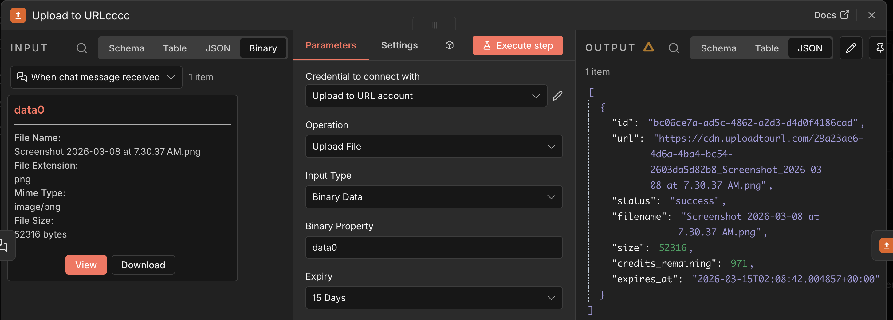
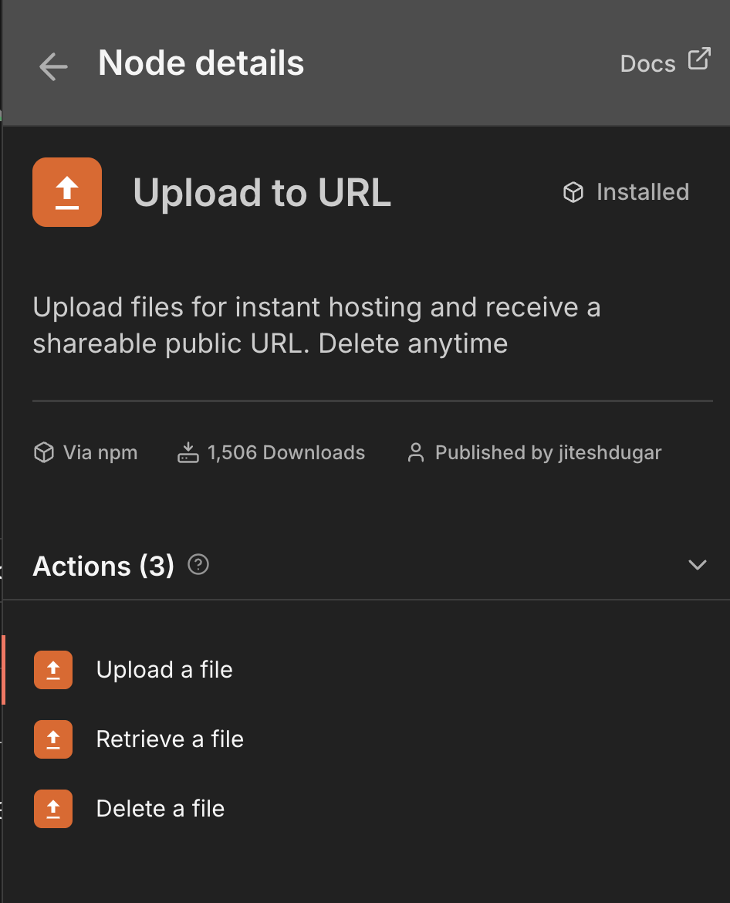

# n8n-nodes-uploadtourl

[](https://uploadtourl.com)

This is a verified [n8n](https://n8n.io/) node that lets you upload any file and get a public URL instantly using [Upload to URL](https://uploadtourl.com). Supports both binary data and base64 string inputs.

This is the link to our n8n verified integration - [https://n8n.io/integrations/upload-to-url/](https://n8n.io/integrations/upload-to-url/)

[n8n](https://n8n.io/) is a [fair-code licensed](https://docs.n8n.io/reference/license/) workflow automation platform.

[Installation](#installation) |
[Operations](#operations) |
[Credentials](#credentials) |
[Usage](#usage) |
[Resources](#resources)

## Setup

The **Upload to URL** node is a verified n8n integration, which means it can be set up directly on both n8n cloud and self-hosted instances without needing to install it through the Community Nodes section.

### In n8n

1. Open your n8n instance.
2. Create or open a workflow.
3. Click the **+** button to add a node.
4. Search for **Upload to URL**.
5. Select it to add it to your workflow.

## Operations

### File Actions

The **Upload to URL** node provides the following operations under the **File Actions** resource:

- **Upload File** — Upload a file (binary data or base64 string) from your workflow and receive a publicly accessible URL in response.
- **Upload Multiple Files** — Upload multiple binary files at once using flexible selection modes (All, Specific Names, or Regex).
- **Upload File from URL** — Fetch a file from a public URL and host it instantly on your server.
- **Download File** — Download a file from any public URL directly into n8n binary storage.
- **Retrieve File** — Retrieve details of a previously uploaded file using its file ID.
- **Delete File** — Delete a previously uploaded file from the server using its file ID.

#### Upload File Parameters

| Parameter | Type | Default | Description |
|-----------|------|---------|-------------|
| **Input Type** | selection | `Binary Data` | Choose between "Binary Data" (from previous nodes) or "Base64 String" (direct base64 input) |
| **Binary Property** | string | `data` | The name of the binary property containing the file to upload. Only shown when Input Type is "Binary Data". |
| **Base64 Data** | string | - | Base64 encoded file data. Only shown when Input Type is "Base64 String". |
| **Filename** | string | `file.bin` | Name of the file (e.g., document.pdf, image.jpg). Required for base64 input. |
| **MIME Type** | selection | `auto` | Choose from common MIME types or select "Custom" to specify your own. Also supports "Auto-detect from filename" to automatically determine the MIME type from the file extension. |
| **Custom MIME Type** | string | - | Custom MIME type (e.g., application/vnd.ms-excel). Only shown when MIME Type is set to "Custom". |
| **Expiry Days** | number | - | Number of days after which the uploaded file will be automatically deleted from the server. Leave empty for no expiration. |

#### Upload Multiple Files Parameters

| Parameter | Type | Default | Description |
|-----------|------|---------|-------------|
| **Selection Mode** | selection | `All Binary Data` | Choose how to select files: "All Binary Data", "Specific Names", or "Regex Pattern" |
| **Binary Property Names** | list | - | A list of specific binary property names to upload. Only shown in "Specific Names" mode. |
| **Property Name Regex** | string | - | A regular expression to match binary properties (e.g., `^attachment_.*`). Only shown in "Regex Pattern" mode. |

#### Upload File from URL / Download File Parameters

| Parameter | Type | Default | Description |
|-----------|------|---------|-------------|
| **File URL** | string | - | The public URL of the file you want to download. |
| **Put Output In Field** | string | `data` | The name of the binary property where the file should be stored. Only shown in "Download File" operation. |
| **Expiry Days** | number | - | Number of days after which the uploaded file will be automatically deleted. Only shown in "Upload" operations. |

#### Retrieve File / Delete File Parameters

| Parameter | Type | Description |
|-----------|------|-------------|
| **File ID** | string | The ID of the file to retrieve or delete. This is returned in the response when a file is uploaded. |

#### Output

The node returns the JSON response from the Upload to URL API, which includes the public URL for the uploaded file.

### Supported Features



- **Multiple Input Types** — Supports both binary data from previous nodes and direct base64 string input.
- **Smart Defaults** — Filename defaults to `file.bin` and MIME type defaults to auto-detection for seamless setup.
- **File Expiry** — Set an expiry period (in days) for uploaded files so they are automatically deleted from the server after the specified time.
- **Retrieve & Delete Files** — Retrieve details of or delete previously uploaded files using their file ID.
- **Batch Processing** — Handles multiple input items; each item's file is uploaded individually.
- **Multiple File Upload** — Upload multiple binary properties from a single item using Regex or Name matching.
- **Instant Re-hosting** — Download a file from any public URL and host it instantly.
- **Continue on Fail** — When enabled, the workflow continues even if an upload fails, returning the error message in the output instead of stopping execution.
- **Usable as Sub-Node / Tool** — Can be used as a tool in AI agent workflows and sub-workflows.

#### Supported File Types

The node supports all file types including:
- **Images**: JPEG, PNG, GIF, WebP, SVG, ICO
- **Documents**: PDF, DOC, DOCX, TXT, CSV, XLS, XLSX
- **Videos**: MP4, AVI, MOV, WMV, FLV, WebM
- **Audio**: MP3, WAV, FLAC, AAC, OGG
- **Archives**: ZIP, RAR, TAR, GZ
- **Any custom file type**

## Credentials

To use this node, you need an **Upload to URL API key**.

### Obtaining an API Key

1. Visit [uploadtourl.com](https://uploadtourl.com)
2. Create an account or sign in
3. Navigate to your API settings to generate an API key

### Setting Up Credentials in n8n

1. In n8n, go to **Credentials**
2. Select **Add Credential**
3. Search for **Upload to URL API**
4. Enter your **API Key** in the provided field
5. Select **Save**

The credential is automatically verified against the Upload to URL API when saved.

## Usage

### Node Overview

The **Upload to URL** node provides a clean interface for uploading files with support for both binary data and base64 string inputs.



### Binary Data Upload (Existing)

1. Add a node that produces binary data (e.g., **Read Binary File**, **HTTP Request**, or a **Webhook** trigger with file upload)
2. Connect it to the **Upload to URL** node
3. Set **Input Type** to "Binary Data"
4. Configure the **Binary Property** name if your binary data uses a property name other than `data`
5. Execute the workflow to upload the file and receive a public URL

### Base64 String Upload (New)

1. Add a node that produces base64 data or use a **Set** node to define base64 content
2. Connect it to the **Upload to URL** node
3. Set **Input Type** to "Base64 String"
4. Configure the following parameters:
   - **Base64 Data**: The base64 encoded string (with or without data URL prefix)
   - **Filename**: The desired filename (defaults to `file.bin` if not specified)
   - **MIME Type**: Choose from the dropdown (defaults to "Auto-detect from filename")
5. Execute the workflow to upload the file and receive a public URL

**Note**: With the default settings, you only need to provide the base64 data. The node will automatically use `file.bin` as the filename and detect the MIME type from the file extension if you change the filename to end with a proper extension (e.g., `image.jpg`).

### Uploading Multiple Files (New)

The **Upload Multiple Files** operation is designed for workflows where a single item contains multiple attachments (e.g., from an Email or Form trigger).

1. **Selection Mode: All Binary Data**
   - No extra configuration needed. Every binary property found in the item is uploaded.
2. **Selection Mode: Specific Names**
   - Add the specific keys you want to upload (e.g., `invoice_pdf`, `receipt_png`).
3. **Selection Mode: Regex Pattern**
   - Match properties dynamically, such as `^attachment_[0-9]+` to grab all email attachments.

**Pro Feature**: The node automatically supports **Binary Arrays**. If a property contains an array of files (common in custom Code nodes), it will iterate and upload every file in that array.

### Uploading from URL (New)

1. Select **Upload File from URL**.
2. Paste the public link to any file (image, PDF, archive, etc.).
3. The node fetches the file, extracts the filename and MIME type from the source headers, and hosts it instantly.

### Downloading Files (New)

1. Select **Download File**.
2. Paste the public link to any file.
3. The node downloads the file and attaches it as a binary property (e.g., `data`) to your item, allowing subsequent nodes (like "Write Binary File") to process it.


### Base64 Input Examples

#### Example 1: Direct Base64 Input
```
[Set Node with base64 data] → [Upload to URL] → [HTTP Request with URL]
```

**Set Node configuration:**
- JSON mode: `{
  "base64Data": "iVBORw0KGgoAAAANSUhEUgAAAAEAAAABCAYAAAAfFcSJ...",
  "fileName": "image.png",
  "mimeType": "image/png"
}`

**Upload to URL configuration:**
- Input Type: "Base64 String"
- Base64 Data: `{{ $json.base64Data }}`
- Filename: `{{ $json.fileName }}`
- MIME Type: `{{ $json.mimeType }}`

#### Example 2: Data URL Input
The node automatically handles data URLs like:
```
data:image/jpeg;base64,/9j/4AAQSkZJRgABAQAAAQ...
```

Simply paste the entire data URL in the **Base64 Data** field, and the node will extract the base64 portion automatically.

#### MIME Type Options

The **MIME Type** dropdown provides several options:

- **Auto-detect from filename**: Automatically determines the MIME type based on the file extension (e.g., `.jpg` → `image/jpeg`, `.pdf` → `application/pdf`)
- **Predefined options**: Common MIME types for images, documents, videos, audio, and archives
- **Custom**: Allows you to specify any MIME type (e.g., `application/vnd.ms-excel` for Excel files)

**Supported Auto-detect Extensions**:
- Images: `.jpg`, `.jpeg`, `.png`, `.gif`, `.webp`, `.svg`
- Documents: `.pdf`, `.txt`, `.csv`, `.json`, `.xml`
- Archives: `.zip`
- Media: `.mp4`, `.mp3`
- Unknown extensions default to `application/octet-stream`

### Example Workflow

```
[Read Binary File] → [Upload to URL] → [Send Email with URL]
```

1. **Read Binary File** reads a local file and outputs it as binary data
2. **Upload to URL** uploads the file and returns a public URL
3. **Send Email** uses the returned URL to share the file link

### Using with HTTP Request

```
[HTTP Request (download file)] → [Upload to URL] → [Slack Message with URL]
```

1. **HTTP Request** downloads a file from any source
2. **Upload to URL** re-hosts the file and provides a permanent public URL
3. **Slack** sends a message containing the file link

### Using in AI Agent Workflows

The node is marked as **usable as a tool**, so it can be used within n8n's AI Agent node. This allows an AI agent to upload files and retrieve public URLs as part of its reasoning process.

## Development

### Prerequisites

- [Node.js](https://nodejs.org/) v22 or higher
- npm

### Setup

```bash
git clone https://github.com/Upload-to-URL/n8n-nodes-uploadtourl.git
cd n8n-nodes-uploadtourl
npm install
```

### Available Scripts

| Script | Description |
|--------|-------------|
| `npm run dev` | Start n8n with the node loaded and hot reload enabled |
| `npm run build` | Compile TypeScript to JavaScript for production |
| `npm run build:watch` | Build with watch mode (auto-rebuild on changes) |
| `npm run lint` | Check code for errors and style issues |
| `npm run lint:fix` | Auto-fix linting issues |
| `npm run release` | Create a new release |

### Local Development

```bash
npm run dev
```

This starts n8n with your node available at [http://localhost:5678](http://localhost:5678) and automatically rebuilds when you make changes.

## Resources

- [n8n Community Nodes Documentation](https://docs.n8n.io/integrations/community-nodes/)
- [Upload to URL Website](https://uploadtourl.com)
- [n8n Community Forum](https://community.n8n.io/)

## License

[MIT](LICENSE.md)
